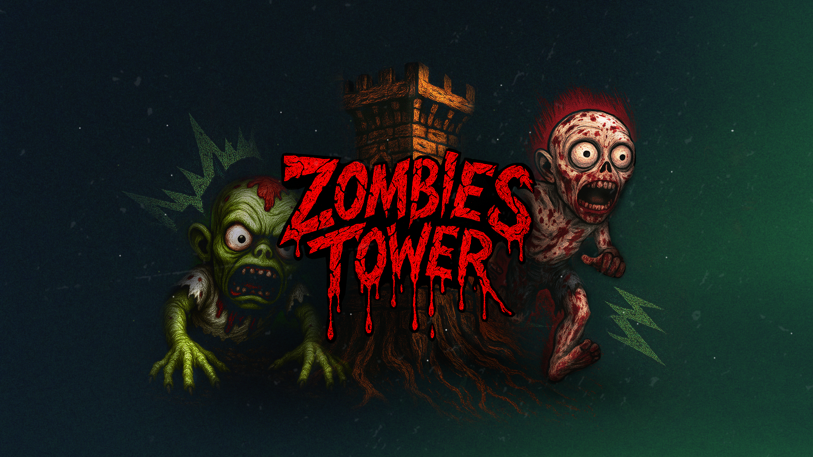
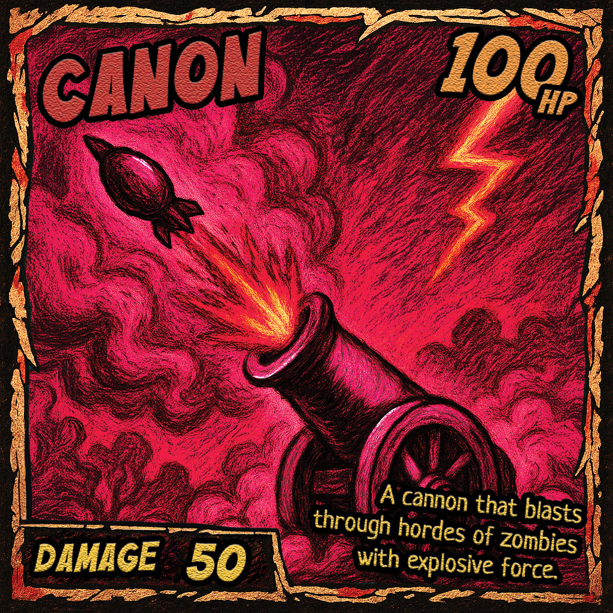
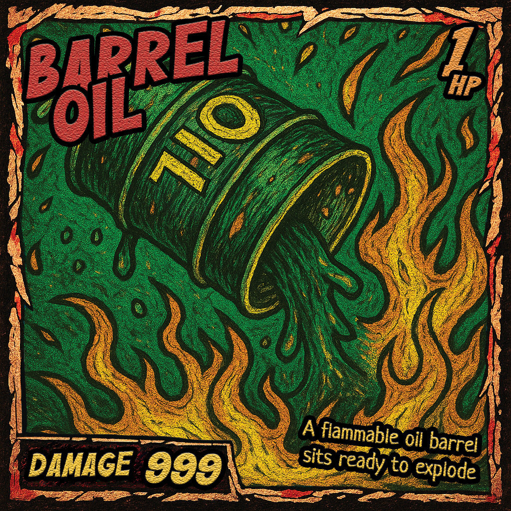
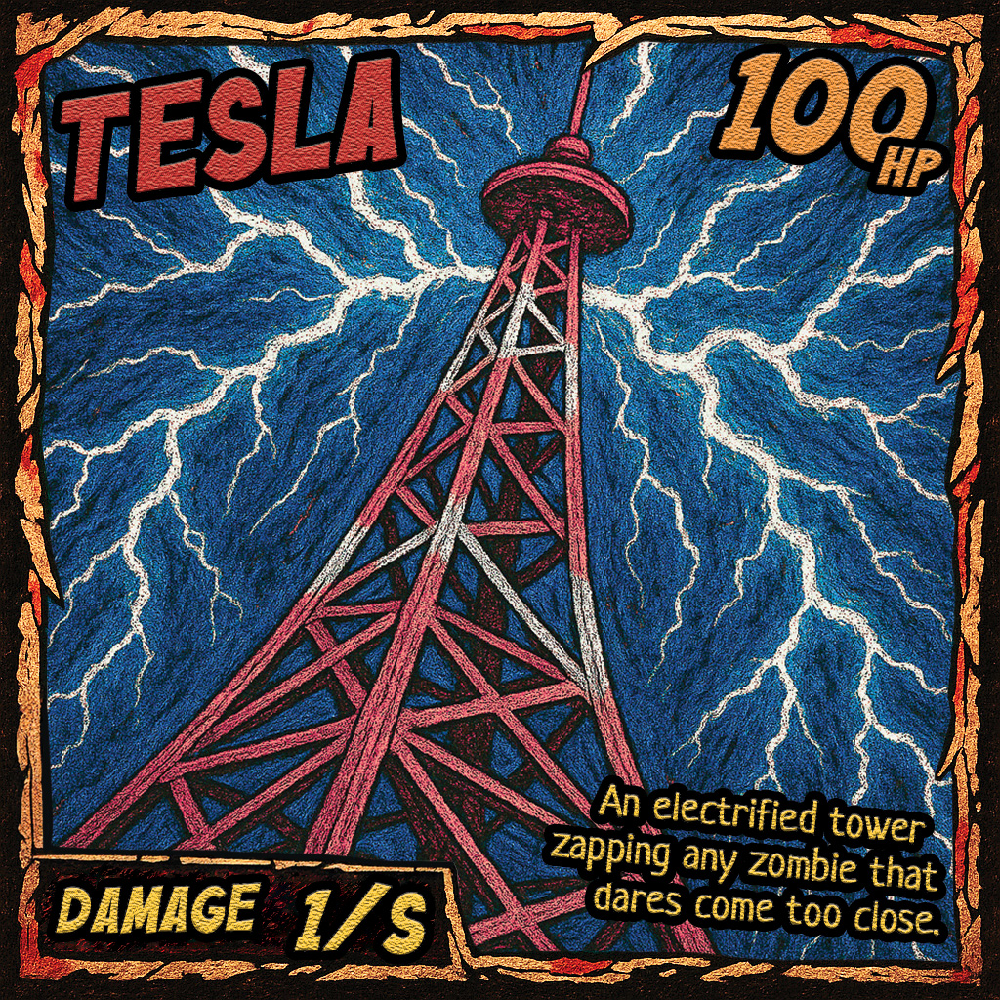
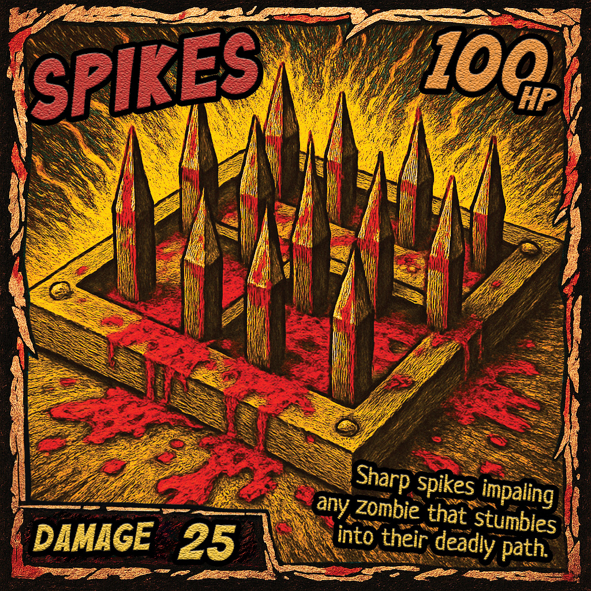
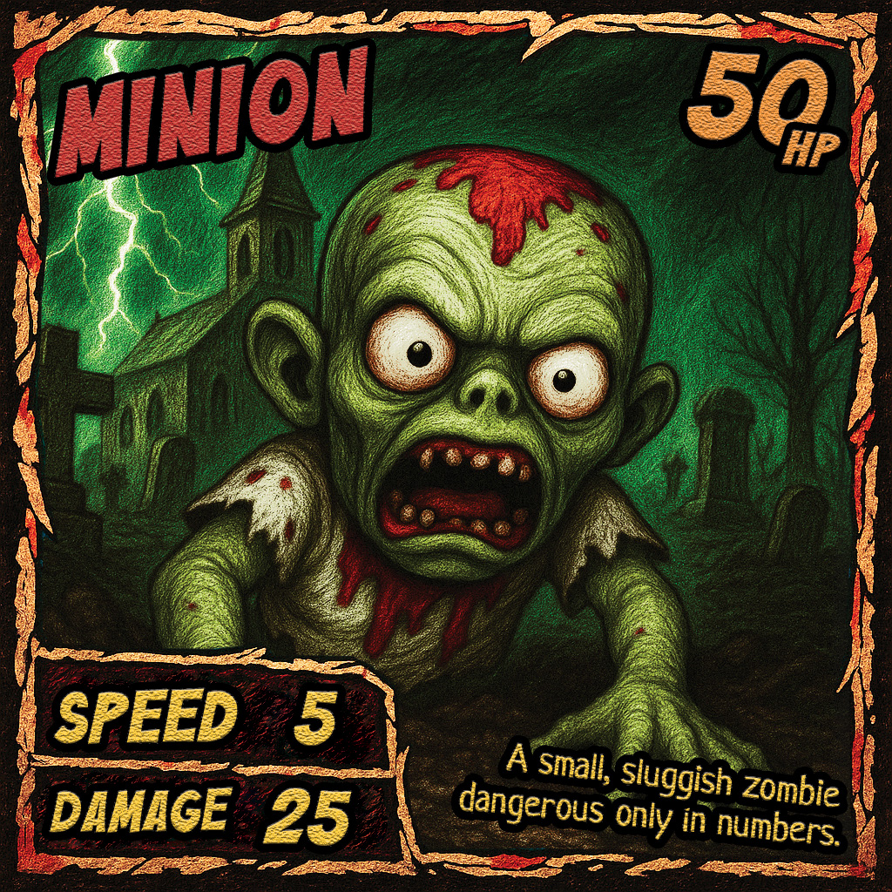
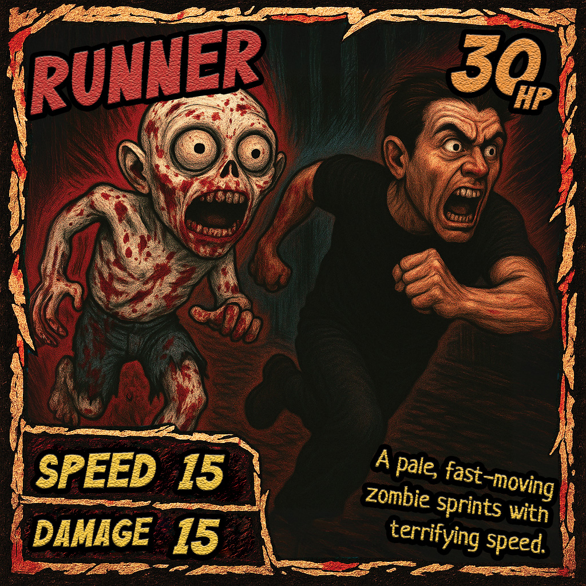
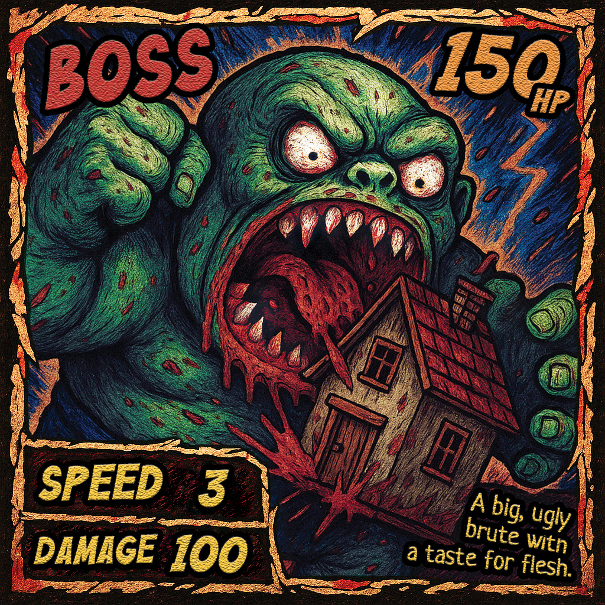
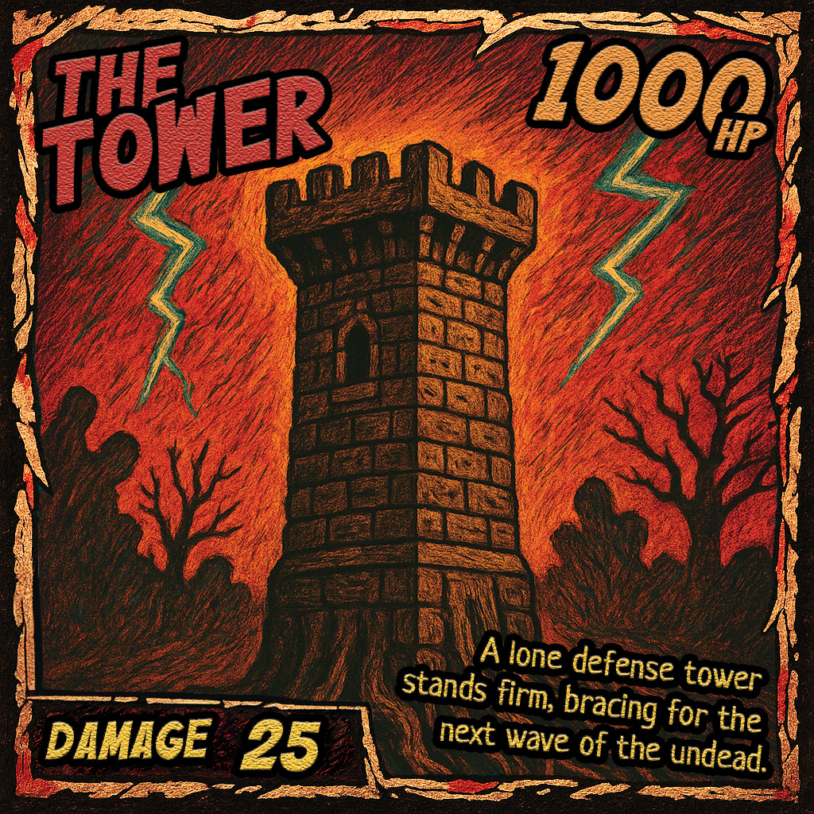
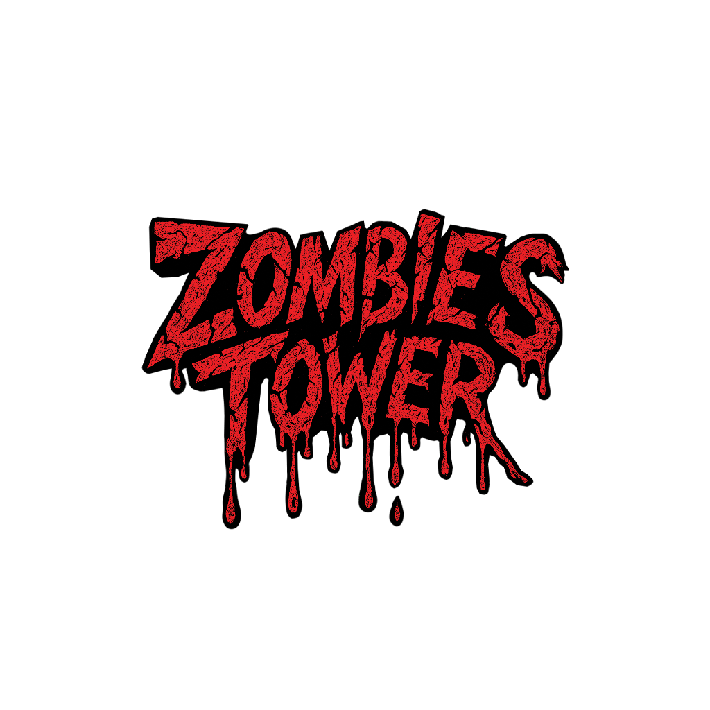

# 🧟‍♂️ Zombies Tower
Bienvenue sur **Zombies Tower**, un projet réalisé en une semaine dans le cadre d’un projet à **HETIC**. Il s'agit d'un tower defense en réalité augmentée, où vous devez protéger votre tour contre des vagues infinies de zombies de différents types, en plaçant des pièges physiques à l’aide de cartes à scanner.

## ⚙️ Technologies :

## 🎮 Comment jouer ?
1. **Clonez** le repository et ouvrez-le avec **Unity**.
2. Ouvrez la scène : `Scenes/ARMain`.
3. Connectez un **téléphone compatible AR** (ARCore ou ARKit).
4. Build sur Android/iOS.
5. **Placez votre tour**, puis appuyez sur **Start** pour commencer la partie !

### 🖨️ Comment obtenir les cartes ?
Vous pouvez :
- **Imprimer** les cartes du dossier `readmeAssets` avec une imprimante classique.
- **Photomaton :** Imprimez les cartes du dossier `readmeAssets/photomaton en **format 10cm x 15cm** pour un rendu plus agréable.

## 🎯 Fonctionnalités principales

- 🏰 Placement libre de la tour en AR
- 🧟‍♂️ Vagues d'ennemis infinies
- ⚔️ La tour attaque automatiquement les ennemis proches
- 🫵 Touchez les ennemis pour leur infliger des dégâts et les faire trébucher
- 📸 Scan d'images réelles pour faire apparaître des pièges dans l'environnement
- 💥 Chaque piège possède un comportement unique
- 🔊 Spatialisation audio 3D (sons réalistes selon la distance)
- 🏆 Affichage du temps de survie et du nombre d'ennemis tués en Game Over

## Bestaires :

### Pièges
---
| Carte | Nom | PV | Dégats | Description |  
| --- | --- | --- | --- | --- |  
|  | Canon | 100 | 50 | Cible les ennemis dans un rayon de 0,5 unité autour de lui et tire toutes les 2 secondes. Les dégâts étourdissent les ennemis. |
| | Barrel | 1 | 999 | Explose au contact d’un ennemi et inflige des dégâts dans un rayon de 0,5 unité. Réapparaît au bout de 5 secondes. |
|  | Tesla | 100 | 1 | Lorsqu’un ennemi entre dans sa zone de 0,6 unité, il est ralenti de moitié et subit 1 dégât par seconde. |
|  | Spike | 100 | 25 | Inflige des dégâts aux ennemis présents dans sa zone toutes les 6 secondes. Les dégâts étourdissent les ennemis. |

### Ennemis
---

| Carte | Nom | PV | Dégâts | Speed | Fréquence d’apparition |  
| --- | --- | --- | --- | --- | --- |  
|  | Minion | 50 | 25 | 5 | 0.8 |
|  | Runner | 30 | 15 | 15 | 0.15 |
|  | Boss | 150 | 100 | 3 | 0.05 |

### Autres
---
| Carte | Nom | PV | Dégâts | Cadence de tir | rayon |  
| --- | --- | --- | --- | --- | --- |  
|  | Tower | 1000 | 25 | 1s | 1.5 |

## Auteurs :
[AlessGarau | Alessandro GARAU](https://github.com/AlessGarau)  
[mirandalucas52 | Lucas MIRANDA](https://github.com/mirandalucas52)  
[MariaPetersen | Maria PETERSEN](https://github.com/MariaPetersen)  
[LeBenjos | Benjamin SCHINKEL](https://github.com/LeBenjos)  
[Feydai | Léo SUN](https://github.com/Feydai)

## Crédits :
Horror Music by Migfus20 -- https://freesound.org/s/683265/ -- License: Attribution 4.0

